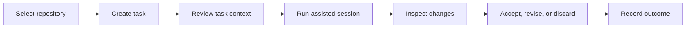

# Codex Task Board

**A visual task, review, and history workspace for local Codex-assisted development.**

> [!NOTE]
> This repository is in the foundation phase. It currently documents the product model and release gates; no production-ready application is available.

## About

Codex Task Board is planned as a desktop workspace for organizing local coding tasks, reviewing proposed file changes, tracking session history, and turning accepted work into clear Git actions. It will sit beside the command-line workflow rather than replacing it.

The project will emphasize reviewability. Users should be able to understand the task, selected repository, changed files, checks, notes, and final decision from one screen.

## Planned workflow

## Planned capabilities

- Register and organize multiple local repositories.
- Create tasks with goals, constraints, acceptance criteria, and priority.
- Track queued, active, review, completed, and blocked work.
- Display changed files and readable Git diffs.
- Attach test results, notes, and review decisions to a task.
- Preserve task history without storing unnecessary project content outside the workspace.
- Provide reusable task templates for bug fixes, tests, refactors, and documentation.
- Generate suggested commit messages from accepted task context.
- Prepare pull-request descriptions for user review.
- Restore an interrupted task view from local state.

## Interface direction

| Area | Purpose |
|---|---|
| Repository rail | Switch projects and review repository state. |
| Task board | Organize planned, active, review, and completed work. |
| Session panel | Display progress, notes, and structured events. |
| Diff review | Inspect file changes before a decision. |
| History | Find prior tasks, outcomes, and related commits. |

## Design principles

- The user remains responsible for accepting changes.
- Diffs and test results should be visible before completion.
- Project data stays local by default.
- Task history should be useful without becoming a hidden copy of the repository.
- Integrations must document version and compatibility assumptions.
- Product screenshots and supported-feature claims require a released build.

## Project status

| Workstream | State |
|---|---|
| Task and session model | Active |
| Local repository registry | Planned |
| Board interface | Planned |
| Diff review | Planned |
| History storage | Planned |
| Packaging | Planned |

## Roadmap summary

1. Define task, session, and review schemas.
2. Build a local repository registry and static board prototype.
3. Add session event capture and diff review.
4. Add history, templates, and exportable task reports.
5. Package a preview build with verified screenshots.

See [ABOUT.md](ABOUT.md) for project positioning and suggested metadata.

## Project relationship

Codex Task Board is an independent companion project and is not an official OpenAI product. Third-party names are used only to describe intended compatibility.

## License

The project license and third-party notices will be finalized before executable source is published.